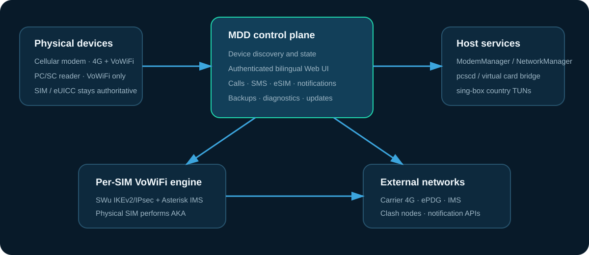

# MDD Sim Gateway


MDD Sim Gateway 是面向自托管设备的多 SIM 通信网关。它把蜂窝模块、USB 读卡器、4G 数据、Wi‑Fi Calling、通话、短信、eSIM 与国家代理出口整合到一个中英文 Web 控制台中。

当前版本：**1.3.3** · [English](README.en.md)

> 本项目直接控制蜂窝模块、SIM、网络路由和 IMS。请只在你拥有或获准管理的设备及号码上使用；运营商是否开放 Wi‑Fi Calling 仍取决于套餐、区域、设备身份和网络策略。

> **合规警告（公开版）：** 本软件仅供号码实名持有人在运营商明确允许的范围内自用。严禁用于诈骗、群呼、营销骚扰、验证码接收、号码或线路出租、代拨转接、隐藏实际控制地点，或向第三人提供电信服务。使用者必须遵守所在地法律、电话实名制和运营商协议；本项目不构成任何电信业务许可或运营商授权。公开版最多保存和运行 **5 条 SIM 线路**，不提供独立 SIP 账号或 Telegram 远程拨号、发短信及挂断功能。技术限制不代表某种使用方式当然合法。

### 界面预览

#### 概览


#### 设备


#### 通话


#### 短信


## 能做什么

- 自动识别蜂窝模块与普通 PC/SC 读卡器；模块可同时管理 4G 和 VoWiFi，读卡器仅显示其支持的 VoWiFi 能力。
- 每个物理模块独立保存 4G、飞行模式和 VoWiFi 期望状态：4G 开关只控制移动数据承载，飞行模式单独控制射频，VoWiFi 独立启停；状态按各自 ModemManager 对象读取。
- 登录后自动检查新版本并每 6 小时刷新一次；发现新版本时左下角版本号显示红点，可直达 Release 页面。
- 使用物理 SIM/eSIM 完成 EAP-AKA 与 IMS-AKA；不读取、不保存 Ki/OP/OPc，也不使用演示鉴权向量。
- 自动读取 IMSI、ICCID、MCC/MNC、SIM SPN/GID 和模块 IMEI；使用内置 AOSP Carrier ID 数据离线识别宿主网络与部分 MVNO，PIN 开启时仅在本机加密边界内使用。
- 每张模块 SIM 显式展示三条逻辑通道的容量、实际分配、用途和错误；部分分配失败会主动释放已打开通道。
- 登录后使用的浏览器软电话、短信收发、通话记录和来电通知；公开版不开放独立 SIP 客户端接入。
- Clash 订阅按国家筛选节点，由 sing-box 建立独立 TUN；候选节点必须通过 UDP 健康检查，失败时按 SIM 故障关闭，不泄漏到错误国家。
- 标准 GET/POST Webhook、Telegram（直连/手动代理/国家出口）和 PushPlus。
- Telegram 仅用于单向推送来电、短信和设备状态通知，不接受远程控制指令。
- 使用 lpac 管理 eUICC 配置文件；支持需要显式选择安全元件的双 SE 卡。
- 中英文界面、HTTPS、首次管理员设置、支持按钮或 Enter 提交的会话登录、CSRF、防暴力登录、审计记录、脱敏支持包、备份与版本检查。



## 硬件模型

| 设备 | 4G 数据 | Wi‑Fi Calling | SIM 访问方式 |
|---|---:|---:|---|
| 支持 ModemManager 的蜂窝模块 | ✓ | ✓ | 模块 AT/逻辑通道桥接 |
| 大疆/Quectel EC25 类模块 | ✓ | ✓ | 自动识别并创建所需虚拟读卡通道 |
| USB PC/SC 读卡器 | — | ✓ | 直接 PC/SC |
| 三体电子 SCR Prime（`04d9:c001`） | — | ✓ | 直接 PC/SC；安装时使用 `patchprime` 驱动补丁 |
| eUICC/eSIM 读卡器 | — | ✓ | PC/SC + lpac |

三体电子 SCR Prime 已通过本项目实机验证；“支持”表示系统具备相应技术路径，不代表所有 SIM、固件或运营商都会放行。多模块 4G 使用独立 ModemManager 对象、NetworkManager 连接和 bearer。

## 快速安装

推荐 Debian/Ubuntu/Armbian ARM64 主机，具备 systemd、Docker、USB 和稳定网络。

```bash
git clone https://github.com/MddIdd/mdd-sim-gateway.git
cd mdd-sim-gateway
sudo ./install.sh install
```

安装脚本会自动：

1. 检查并复用现有系统 Docker（没有时才从发行版安装），安装 pcscd、ModemManager/NetworkManager；
2. 按架构下载 sing-box 1.13.15 并验证 SHA-256；
3. 下载固定版本 lpac 2.3.0 源码并本地构建；
4. 构建 MDD 控制面、WebUI 与每 SIM VoWiFi 引擎；
5. 安装 systemd 服务并设置开机启动。

已有 Docker 不会被升级、重配或清理；安装前会检查 rootless 模式、端口占用与容器归属，只管理带 MDD 标记的容器。

首次打开 `https://<网关地址>:8443` 创建管理员账号。自签名证书可用于初次部署；长期使用建议在设置中配置受信任证书。
请在受信的局域网或 VPN 中立即完成首次设置；在管理员账号建立前，任何能访问管理端口的客户端都可以申领首个管理员。

常用命令：

```bash
sudo ./install.sh status
sudo ./install.sh logs
sudo ./install.sh reload
sudo ./install.sh build-lpac
sudo ./install.sh uninstall
```

完整说明见 [安装与升级](docs/INSTALL.md)，系统边界见 [架构说明](docs/ARCHITECTURE.md)，问题排查见 [故障排查](docs/TROUBLESHOOTING.md)。

## 国家出口如何工作

在“网络出口”填写 Clash 订阅后，为 SIM 国家添加一个出口。关键词匹配的是订阅中的**节点名称**，所有匹配节点进入 sing-box `urltest` 池；界面显示实际选中的节点名。系统额外验证 UDP 能力，因为 IKEv2/ESP NAT 穿越依赖 UDP 500/4500。每个国家使用独立 TUN（例如 `mdd-jp`），只有对应 SIM 的 ePDG 路由进入该接口。

## 安全与隐私

- 管理端默认 HTTPS，首次设置管理员密码，密码使用 scrypt 加盐保存。
- 会话 Cookie 为 HttpOnly/Secure/SameSite=Strict；修改请求要求 CSRF 令牌。
- 引擎事件使用安装级随机令牌，不接受未认证回调。
- 支持包会移除 IMSI、ICCID、EID、号码、PIN、Token、URL、激活码、密钥与消息正文；分享前仍应人工复核。
- 运行数据目录只允许 root 访问，含凭据的配置与线路文件以 `0600` 权限原子写入。
- 不提供 Ki/OP/OPc 输入或软件 Milenage 路径，AKA 密钥留在 SIM/eSIM 内。
- 订阅 URL、通知 Token、SIM PIN 和运营商身份属于敏感数据；不要提交 `data/`、`.env` 或真实截图。

安全问题请按 [SECURITY.md](SECURITY.md) 私下报告，数据处理边界见 [PRIVACY.md](PRIVACY.md)。

## 开源与致谢

MDD Sim Gateway 以 **GPL-3.0-only** 发布。它包含或调用多个独立上游组件，各自仍遵循原许可证；完整清单见 [THIRD_PARTY_LICENSES.md](THIRD_PARTY_LICENSES.md) 和 [NOTICE](NOTICE)。

特别感谢：

- [pagecat/vowifi_gateway](https://github.com/pagecat/vowifi_gateway)：本项目的上游基础（MIT）——VoWiFi 引擎与管理端/引擎/WebUI 的整体架构源自该项目；本项目在其之上增加了 4G 蜂窝数据与短信、按国家的网络出口路由、统一设备管理与自动开通、故障转移以及测试体系；
- [fasferraz/SWu-IKEv2](https://github.com/fasferraz/SWu-IKEv2)：SWu IKEv2/IPsec 基础实现；
- [phcoder/asterisk-docker](https://github.com/phcoder/asterisk-docker) 与 [sysmocom Asterisk](https://gitea.sysmocom.de/sysmocom/asterisk)、[sysmocom pjproject](https://gitea.sysmocom.de/sysmocom/pjproject)：IMS-AKA、语音和短信；
- [mitshell/card](https://github.com/mitshell/card)：USIM/PCSC 辅助代码；
- [SagerNet/sing-box](https://github.com/SagerNet/sing-box)：国家代理出口；
- [estkme-group/lpac](https://github.com/estkme-group/lpac)：eSIM LPA；
- [LudovicRousseau/PCSC](https://github.com/LudovicRousseau/PCSC)、[CCID](https://github.com/LudovicRousseau/CCID) 与 [pyscard](https://github.com/LudovicRousseau/pyscard)：智能卡基础设施；
- [frankmorgner/vsmartcard](https://github.com/frankmorgner/vsmartcard)：虚拟 PC/SC 驱动（vpcd），4G 模组 SIM 槽位的基础。

本项目不是上述项目、运营商或设备厂商的官方产品，也不受其背书。
